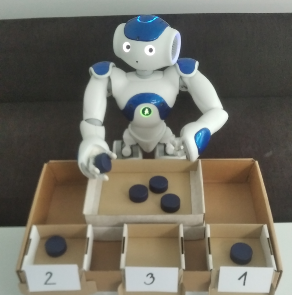

# Initial Experiments

Initial experiments with ChatGPT-5 for generating PDDL domain models from images of shoebox-tasks (arithmetical and matching).

The generated domains are syntactically valid when evaluated with the Python Tarski parser (logs: [arithmetical](./arithmetic/_log.txt), [matching](./matching/_log.txt)), and appear semantically correct. Evaluation on concrete task instances is planned as future work.

For images that include our Nao robot solving the task, he is represented as a PDDL object (`robot`); however, only one of his hands is modeled for object manipulation:
[PDDL](./arithmetic/tasks/pucks_6_with_Nao_20260427_031607.pddl)

